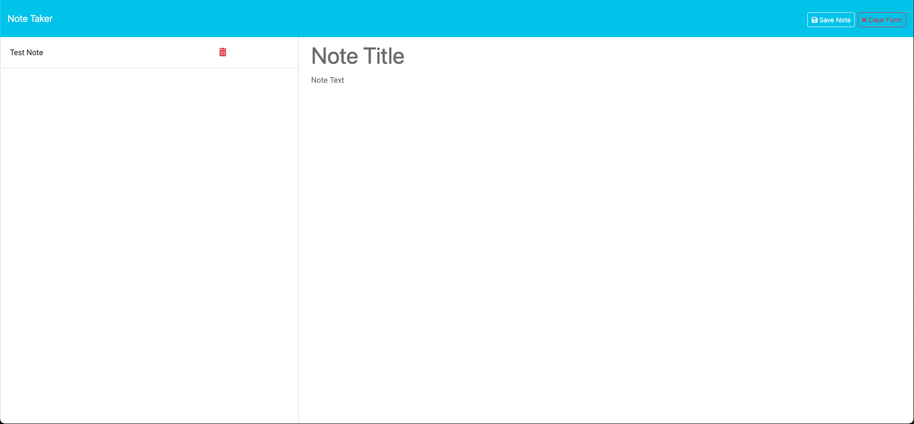

# note-taker-using-express.js

## Description

I am modifying starter code to create an application called Note Taker that can be used to write and save notes. This application will use an Express.js back end and will save and retrieve note data from a JSON file.

## Table of Contents
        
- [Installation](#installation)
- [Usage](#usage)
- [Credits](#credits)
- [License](#license)

## Installation
        
In order to use this application, the user needs Node.js, a command-line application, and express.js.

## Usage
        
To run the applicaton simply visit: 

## Credits
        
GitHub: https://github.com/RickHennessey87
Email: pjhennessey89@gmail.com

## License
    
This project is covered by the MIT License license.

[MIT License](https://opensource.org/licenses/MIT)
        
## How to Contribute 

No contributions needed.
        
## Tests
        
No tests to run. 

